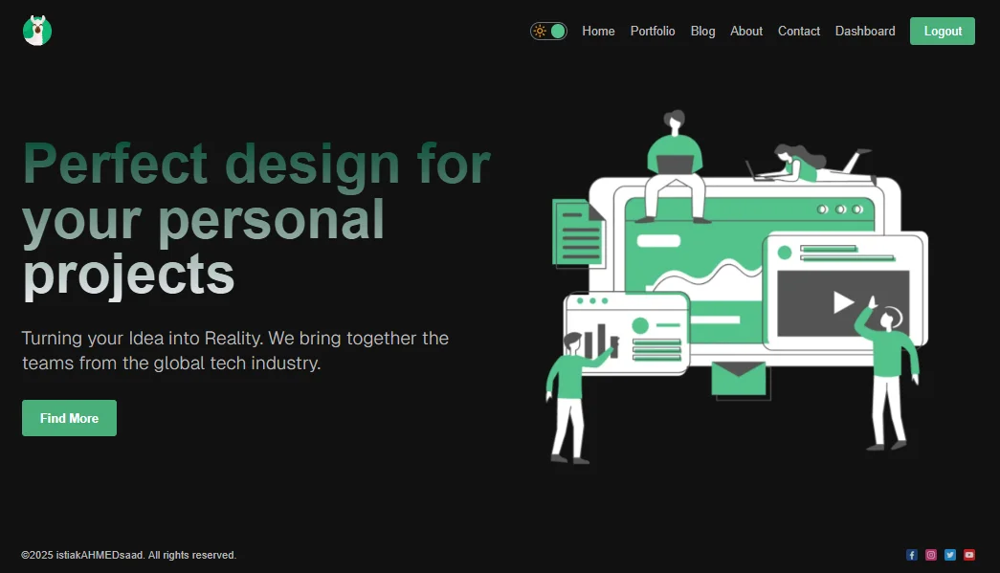

# Lamamia

This project contain nextjs15 powerful feathers like seo, mutate, ssr etc...



**Live Page: [LINK](#)**

_Dependencies Used:_

```
"dependencies": {
    "bcryptjs": "^3.0.3",
    "lucide-react": "^0.561.0",
    "mongoose": "^9.0.2",
    "next": "^15.5.7",
    "next-auth": "^4.24.13",
    "react": "19.1.0",
    "react-dom": "19.1.0",
    "react-icons": "^5.5.0",
    "react-toastify": "^11.0.5",
    "swr": "^2.3.8"
  }
```

### generate secret key:

```
openssl rand -base64 32
```

on node:

```
require('crypto').randomBytes(64).toString('hex')
```
